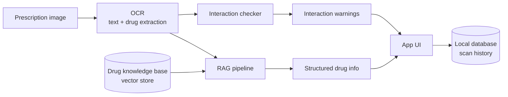

# MediScanAI
 
> AI-powered prescription scanner that reads a prescription image, extracts the prescribed medications, surfaces structured drug information through a RAG pipeline, and flags potential drug–drug interactions.
 


 
---
 
## Overview
 
MediScanAI takes a photo of a prescription, runs OCR to pull out the medication names, and then uses a retrieval-augmented generation (RAG) pipeline over a curated drug knowledge base to return clear, structured information about each drug — what it's for, how it's typically used, and what to watch out for. It then cross-checks the full medication list for known drug–drug interactions and persists each scan for later review.
 
This is the **v2 rebuild**: a cleaner RAG pipeline, a dedicated drug-interaction module, and an evaluation suite to measure extraction and retrieval quality.
 
> ⚠️ **Medical disclaimer:** MediScanAI is a personal/educational project. It is **not** a medical device and must not be used for diagnosis, treatment, or any real clinical decision-making. Always consult a licensed pharmacist or physician.
 
---
 
## Demo
 


https://mediscanai-awawujdbrqnw6df6eajuxa.streamlit.app/

 
---
 
## Features
 
- **Prescription OCR** — extracts text and medication names from an uploaded prescription image.
- **RAG-based drug lookup** — embeds a drug knowledge base into a vector store and retrieves the most relevant entries to ground the model's response (no hallucinated drug facts).
- **Drug–drug interaction checks** — flags potentially risky combinations across all detected medications.
- **Persistent history** — every scan and its results are stored locally for review.
- **Evaluation suite** — `eval.py` measures extraction/retrieval performance against a known set of cases.
- **Sample generator** — `create_sample_prescription.py` produces a synthetic prescription image for quick end-to-end testing.
---
 
## How it works
 

 
1. The user uploads a prescription image in the app.
2. OCR extracts the raw text and identifies the prescribed medications.
3. `build_knowledge_base.py` has already embedded `drug_contents.csv` into a vector store; the pipeline retrieves the most relevant entries for each detected drug.
4. The model generates a grounded, structured summary per drug.
5. `interactions.py` checks the full medication list for known interactions.
6. Results are shown in the UI and saved via `database.py`.
---
 
## Project structure
 
| File | Purpose |
|------|---------|
| `app.py` | Application entry point / UI |
| `pipeline.py` | Core RAG pipeline (OCR → retrieval → generation) |
| `build_knowledge_base.py` | Builds the vector knowledge base from `drug_contents.csv` |
| `interactions.py` | Drug–drug interaction logic |
| `database.py` | Storage layer for scans and results |
| `eval.py` | Evaluation suite for extraction/retrieval quality |
| `create_sample_prescription.py` | Generates a synthetic prescription image |
| `drug_contents.csv` | Source drug knowledge base |
| `sample_prescription.png` | Example input image |
| `requirements.txt` | Python dependencies |
 
---
 
## Getting started
 
### Prerequisites
- Python 3.10+
- An API key for the LLM provider used in the pipeline (set as an environment variable)
### Installation
 
```bash
git clone https://github.com/RujulKhatavkar/MediScanAI.git
cd MediScanAI
python -m venv .venv
source .venv/bin/activate        # Windows: .venv\Scripts\activate
pip install -r requirements.txt
```
 
### Configuration
 
Set your API key (adjust the variable name to match the provider used in `pipeline.py`):
 
```bash
export ANTHROPIC_API_KEY="your-key-here"   # or OPENAI_API_KEY, etc.
```
 
### Build the knowledge base
 
```bash
python build_knowledge_base.py
```
 
### Run the app
 
```bash
python app.py
# or, if it's a Streamlit app:
# streamlit run app.py
```
 
### Try it with the sample
 
Use the included `sample_prescription.png`, or generate a fresh one:
 
```bash
python create_sample_prescription.py
```
 
---
 
## Evaluation
 
Run the evaluation suite to check extraction and retrieval quality:
 
```bash
python eval.py
```
 
<!-- IMAGE: optional — a chart or table screenshot of eval results -->
<!--  -->
 
---
 
## Tech stack
 
- **Language:** Python
- **Retrieval:** vector store over the drug knowledge base (RAG)
- **OCR:** image-to-text extraction of prescriptions
- **LLM:** generation grounded on retrieved drug context
- **Storage:** local database for scan history
*(Update this section with the exact libraries — e.g. ChromaDB, sentence-transformers, the OCR engine, and the LLM/provider — once confirmed against the code.)*
 
---
 
## Roadmap
 
- Broaden the drug knowledge base coverage
- Confidence scoring on OCR-extracted drug names
- Dosage and frequency parsing
- Exportable scan reports
---
 
## License
 
Released under the MIT License. See `LICENSE` for details.
